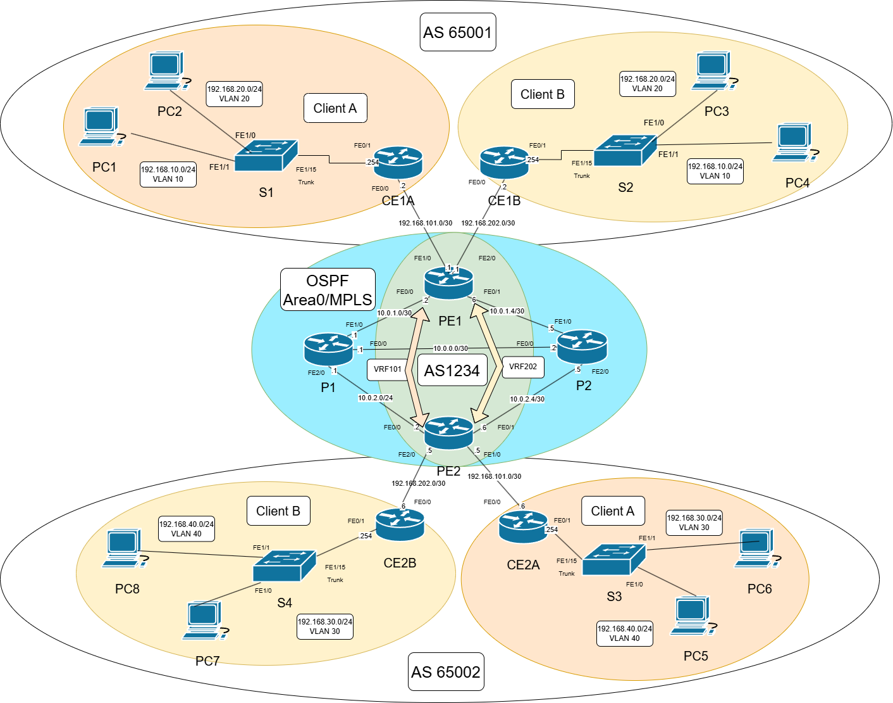

Conception d'un Réseau Multi-Sites Sécurisé (MPLS, BGP, IPsec)

## Description
Ce projet simule une infrastructure réseau FAI sécurisé. L'objectif est de fournir une connectivité sécurisée et isolée à deux clients distincts (A et B), possédant chacun plusieurs sites géographiques.

## Technologies & Protocoles
* **Infrastructure Opérateur (Backbone) :**
    * OSPF (Area 0) pour le routage interne.
    * MPLS (LDP) pour la commutation de labels.
    * MP-BGP pour l'échange de routes clients.
* **Isolation (Segmentation) :**
    * VRF Lite (Virtual Routing and Forwarding) pour séparer les tables de routage Client A / Client B.
* **Sécurité (Edge) :**
    * Tunneling IPsec (Site-to-Site) avec chiffrement AES et authentification SHA-HMAC.
    * ACLs (Access Control Lists) pour filtrer le trafic non autorisé.
    * Sécurisation des accès routeurs (SSH).
* **LAN & Services :**
    * VLANs & Trunking (802.1Q).
    * DHCP Server (IPv4 & IPv6 SLAAC).
    * QoS (Quality of Service) pour prioriser la VoIP.

## Architecture
L'architecture est divisée en trois zones autonomes (AS) :
1.  **AS 1234 (Opérateur) :** Cœur de réseau MPLS composé de routeurs P (Provider) et PE (Provider Edge).
2.  **AS 65001 (Site Client 1) :** Réseau local avec routeurs CE (Customer Edge).
3.  **AS 65002 (Site Client 2) :** Site distant interconnecté.

## Installation / Simulation
Ce projet a été réalisé sous GNS3 avec des routeurs Cisco c3725.

1.  Cloner le dépôt :
    `git clone https://github.com/fbm31/Secure-MultiSite-Network-MPLS-IPsec.git`
2.  Les fichiers de configuration startup-config se trouvent dans le dossier `/configs`.
3.  Importer les configurations dans vos routeurs respectifs.

## Focus Sécurité : IPsec & ACL
Pour garantir la confidentialité des échanges entre les sites clients traversant le backbone opérateur, un tunnel IPsec a été monté.
* **Phase 1 (ISAKMP) :** Authentification Pre-Shared Key, Algorithme AES.
* **Phase 2 (IPsec) :** Transform-set ESP-AES ESP-SHA-HMAC.

Des ACLs ont été appliquées sur les interfaces Edge pour bloquer tout trafic non chiffré ou non légitime (Telnet bloqué, SSH autorisé).

## Auteurs
 Fabien MOINE
